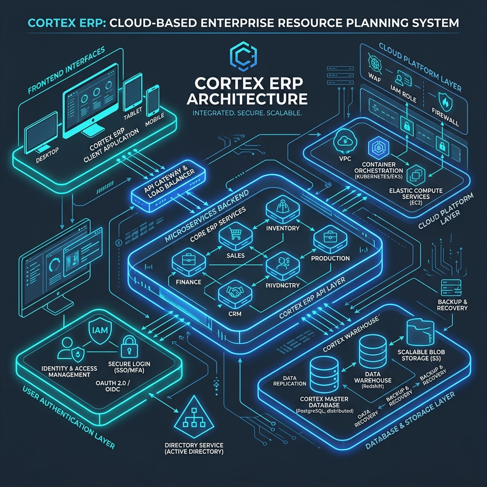
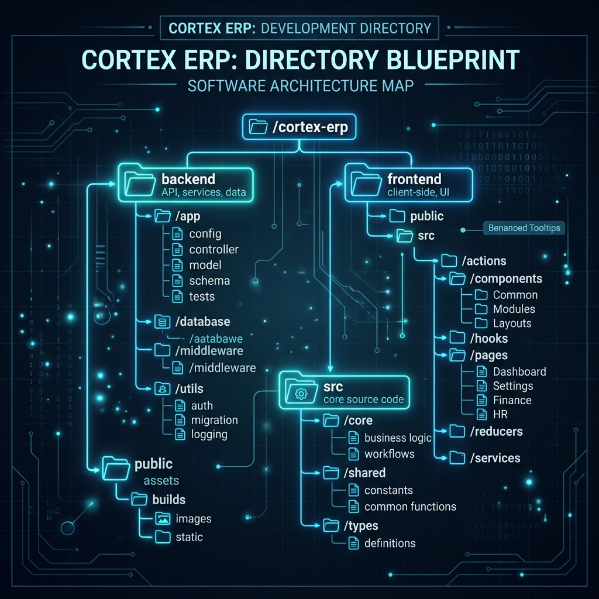

# 🚀 Cortex Enterprise ERP

Welcome to **Cortex Enterprise**! This isn't just another boring admin dashboard. It's a fully-fledged, voice-and-text-activated ERP system designed to make managing your business actually enjoyable. Think of it as your company's central nervous system—fast, smart, and locally optimized using NVIDIA NIM APIs alongside the rock-solid Supabase Postgres for all your data needs.

Whether you're looking up financial ledgers, tracking inventory, or digging into unstructured QA logs with semantic search, Cortex handles it gracefully. 

---

## 🏗️ How It All Fits Together

Here is a high-level look at how Cortex operates under the hood. We built this to be robust, secure, and incredibly fast.



When a user speaks or types a prompt, it's orchestrated by Meta's Llama 3.3 (powered by NVIDIA NIM), which instantly routes the request to the right database tables—whether that's a strict relational query for finances or a vector semantic search for finding specific hardware testing logs. Then, it synthesizes everything into a clean, human-readable markdown report.

---

## 🛠️ The Tech Stack

We hand-picked tools that offer both power and flexibility:

- **The Brains (NVIDIA NIM)**: 
  - We use **NVIDIA Riva ASR** for instant speech-to-text.
  - **Meta Llama 3.3 70B Instruct** handles orchestration and tool routing.
  - **NeMo Retriever NIM** powers our vector embeddings (1024 dimensions of pure semantic understanding).
- **The Vault (Supabase / PostgreSQL)**:
  - **Relational Data**: Strict transactional ledgers and employee records live here.
  - **Semantic Storage**: Unstructured QA and hardware logs are stored using `pgvector` with a custom HNSW index.
- **The Engine**: Node.js & TypeScript running on Express.

---

## 📂 Project Blueprint

Navigating the codebase is straightforward. Here’s a quick map of where everything lives:



The project is split into two main sections:
- `supabase/`: Contains the database migration files necessary to set up your tables, vector extensions, and custom search functions.
- `backend/`: The heart of the application, housing the Express server, API configurations, and the core orchestration logic.

---

## 🚀 Getting Started

Ready to spin it up? Here’s the quick and easy way to get Cortex running locally:

### 1. Database Setup (Supabase)
First, you need to prep your database. Grab the SQL code from [supabase/migrations/20260618000000_init.sql](file:///e:/AI_ERP_System/supabase/migrations/20260618000000_init.sql) and run it in your Supabase SQL editor. This single file builds your tables, activates the vector extension, and sets up our custom `match_logs` search function.

### 2. Configure Your Environment
Head into the `backend/` folder and duplicate the example config file:
```bash
cp backend/.env.example backend/.env
```
Open up `.env` and paste in your `SUPABASE_URL`, `SUPABASE_SERVICE_ROLE_KEY`, and `NVIDIA_BUILD_API_KEY`. 

*(Pro tip: If you leave the keys empty, the app falls back into local mock mode, so you can still develop offline!)*

### 3. Fire It Up
Install the dependencies and start the local development server:
```bash
cd backend
npm install
npm run dev
```
Boom! 💥 The server will boot up and start listening on `http://localhost:8000`.

---

## 🔌 Using the API

Here are the main endpoints you'll be interacting with:

- **`GET /health`** - A quick ping to check if the database is breathing.
- **`POST /api/seed`** - Shoots a bunch of sample data (employees, ledgers, and generated testing logs) into your Supabase database so you have something to play with.
- **`POST /api/query`** - The magic endpoint. Send it a prompt like `"Show me the logs regarding PCB board shorts and high resistance"`, and it will route, search, and synthesize a complete markdown report for you.
